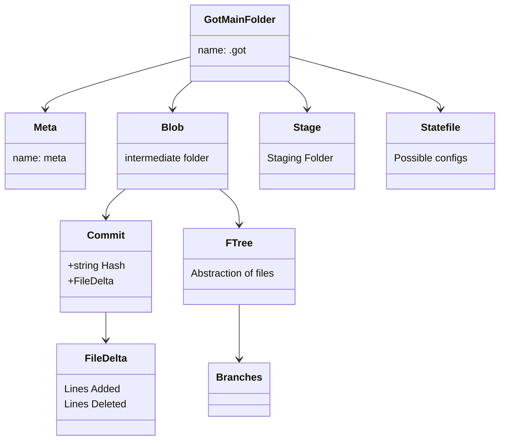

Goal: be able to create branches and merge.

# Architecture

## Init

### Folder Structure

```mermaid
classDiagram
    GotMainFolder --> Meta
    GotMainFolder --> Blob
    GotMainFolder --> Stage

    Blob --> Commit
    Commit --> FileDelta
    Blob --> FTree
    FTree --> Branches
    GotMainFolder --> Statefile
    class GotMainFolder {
        name: .got
    }
    class Meta {
        name: meta
    }
    class Commit {
        +string Hash
        +FileDelta
    }
    class FTree {
        Abstraction of files
    }
    class FileDelta {
        Lines Added
        Lines Deleted
    }
    class Blob {
        intermediate folder
    }
    class Statefile {
        Possible configs
    }
    class Stage {
        Staging Folder
    }
```